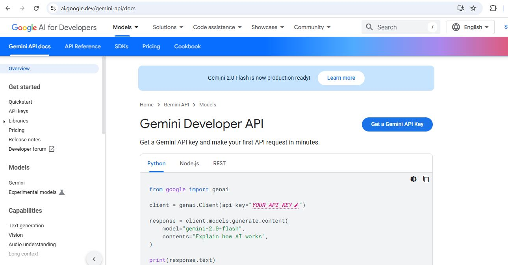
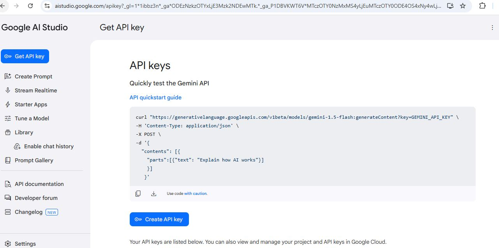

# Gemini-Clone-WithReact
## Personal Chatbot using Google Gemini Api

This project uses React js and Google Gemini's Api to take prompts from users and fetch them to Google's generative AI using Api, then display back the response to the user.
Google's Gemini developer api allow developers to integrate the Gemini generative ai in their project. In this project, I have tried to create a UI (clone) the Gemini chatbot interface.

## Steps to Run the project

1. clone this reposintory
2. Open terminal and navigate to the project directory
3. Run the following command to install the dependencies:
```bash
    npm install
```
4. ### create personal API key
    4.1 On your browser, head to the following url: https://ai.google.dev/gemini-api/docs
    4.2 On the page, click the "Get a Gemini API Key" button.

    

    4.3 On the page that appears, click the "Create API key" button.

    

    4.4 Copy your personal API key
    4.5 In the project, head to src/config and open gemini.js file.
    4.6 paste your API KEY on the apiKey variable [line 9]: const apiKey = "YOUR API KEY";
    4.7 On terminal, run the following command: npm install @google/generative-ai
```bash
    npm install @google/generative-ai
```
5. Run the following command to run the project:
```bash
    npm run dev
```

